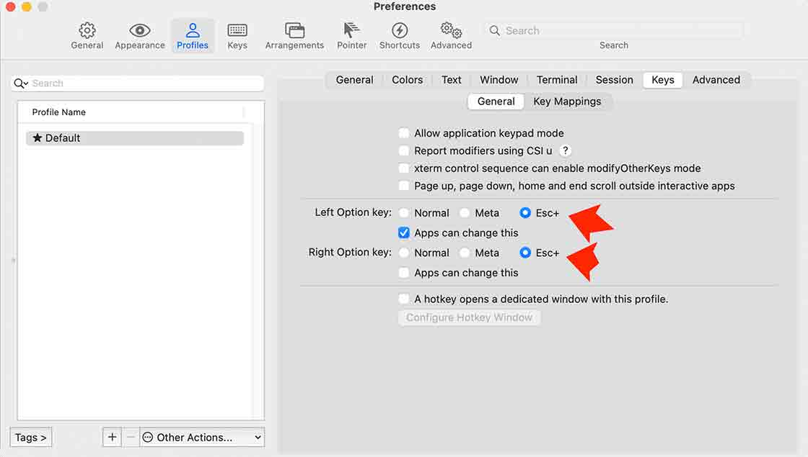

# Emacs Learn

### 安装 Emacs
`brew install --cask emacs`

进入Emacs

在使用Emacs之前 需要解决Mac按键冲突问题

- Meta 映射问题 

- Mac输入法切换需要使用Ctrl+Space Emacs需要使用Ctrl+Space做映射 

# 基本操作常用按键

**组合按键**
- C (Ctrl) eg: C-n 指的是 Ctrl+n 光标向下移动
- M (Alt) Mac中映射为option eg: M-x 指的是 Meta+x 命令扩展 在Mac中可使用 option+x
- S (Shift)

#### 光标移动

- C-n 向下一行
- C-p 向上一行
- C-f 向右移动一个字符
- C-b 向左移动一个字符
- M-f 将光标右移一个单词
- M-b 将光标左移一个单词
- C-a 回到行首位
- C-e 回到行尾
- M-< 回到顶部
- M-> 回到底部
- C-v 向下翻屏
- M-v 向上翻屏
- C-l 将光标所在行移动到屏幕中央
- M-m 将光标移动到行首的第一个非空白字符

#### 查找和替换操作

- C-s 向前查找
- C-r 向后查找
- C-M-s 向前正则查找
- C-M-r 向后正则查找
- M-% 查找并替换 （y表示替换并跳到下一个 n表示忽略并跳到下一个 q表示结束 !表示替换全部）

#### 文本选择操作

- C-Spc-e 选中从当前位置到行尾的文本
- C-Spc-a 选中从当前位置到行首的文本
- C-Spc-n 从当前位置开始往下选中的文本
- C-Spc-p 从当前位置开始往上选中的文本
- C-Spc-f 从当前位置开始往右选中一个字符
- C-Spc-b 从当前位置开始往左选中一个字符
- M-Shift-f 从当前位置往右选中一个单词
- M-Shift-b 从当前位置往左选中一个单词
- M-Shift-e 选中从当前位置开始到当前句尾的文本
- M-Shift-a 选中从当前位置开始到行首的文本
- C-Spc-v 向下选中一屏
- M-Shift-v 向上选中一屏
- C-x h 全选整个屏幕

#### 文本编辑操作

- C-k 删除光标到行尾的所有字符
- Backspace 删除当前光标的前一个字符
- C-d 往右边删除一个字符
- M-k 删除到句子结尾（一句话）
- M-d 删除一个单词
- M-Backspace 删除光标前的一个单词
- C-u 0 C-k 或者 M-0 C-k 删除当前行光标前所有的文本
- M-w 复制选中的文本
- C-x C-q 让当前buffer在“只读”和“读写”之间切换
- C-w 剪切
- C-y 粘贴
- C-u [N] [操作序列] 重复执行一个操作序列N次 eg: C-u 3 * 按下Ctrl+3 * 输出 ***
- C-/ 或者 C-x u 撤销（undo）
- C-g C-/ 重做（redo）

#### 多窗口与多窗格

- C-x 1 仅保留当前窗格 关闭其他窗格
- C-x 2 在垂直方向打开2个窗格
- C-x 3 在水平方向打开两个窗格
- C-x o 在不同窗格之间切换
- C-x 0 关闭当前窗格
- C-x Shift-{ 当前光标在左边窗格减小当前窗格水平宽度
- C-x Shift-} 当前光标在左边窗格增大当前窗格水平宽度
- C-x Shift-^ 当前光标在上面窗格增高当前窗格的高度
- C-M-v 将另一个窗格向下滚动一屏幕（但光标还是在当前窗格）
- M-x make-frame 打开一个新窗口
- M-x delete-frame 关闭当前窗口
- C-z 挂起当前的窗口 （fg再次进入Emacs）

#### Buffers

- C-x C-f 创建或进入一个buffer
- C-x C-b 列出所有的buffer
- C-x b 切换到另一个buffer
- C-x s 保存每个buffer的内容
- C-x `<Left>` 在多个buffer之间切换
- C-x `<Right>` 在多个buffer之间切换
- C-x k 关闭buffer

#### 帮助文档操作

- C-h t 查看Emacs快速指南
- C-h f 查看一个函数（命令）的帮助文档
- M-x help 查看帮助
- C-h i 查看新息字典文档
- C-h r 查看使用手册

